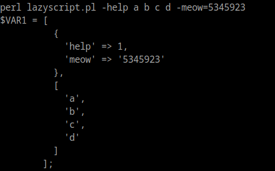

# GetOptLazier
The laziest perl arg parser around

# cpan
now in cpan! \
`cpanm Getopt::Lazier`

# Synopsis

```
use Getopt::Lazier "varname";

use Data::Dumper; print Dumper([$varname, \@ARGV]);
```

# Examples

```
echo '
  use lib "./lib"; use Getopt::Lazier "opt"; 
  use Data::Dumper; print Dumper([$opt, \@ARGV])
' > lazyscript.pl
perl lazyscript.pl -help a b c d -meow=5345923
```


